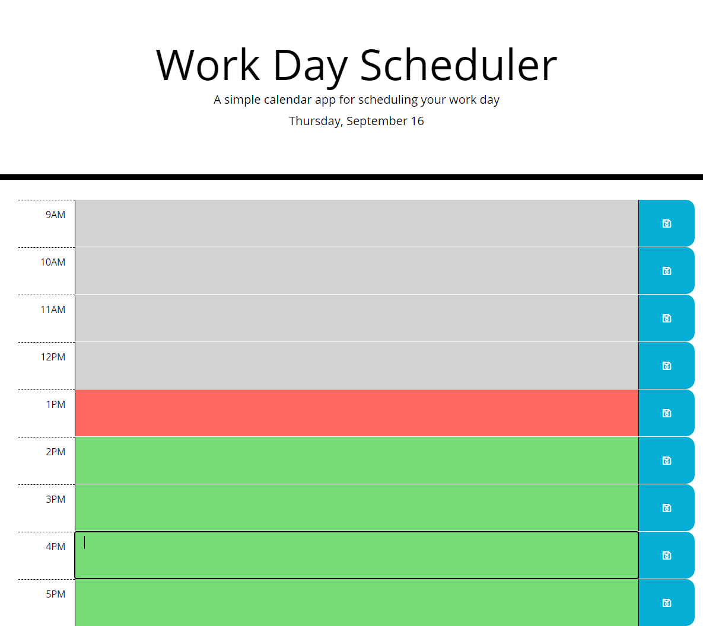
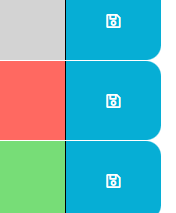

<h1> Work Day Scheduler </h1>

 The Application is composed of only one page. The user can enter events for their day and use the blue button at the end of every lines to save the event in local storage.
The events are automatically loaded back from local storage when the user open or refresh the page. 

The moment of the day are indicated by different in the text areas. A grey color mean that the event already happened, a red color mean that the event is currently happening and
a green color mean that the event will happen later.

The local storage is limited to a certain size in most browser so the application also automatically clean the events from the previous days.

<h1> Screenshots </h1>

 Main Page 

 The save buttons 

